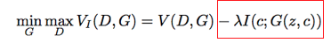

# Recent Advances in Deep Learning

## Table of Contents

This document is a compilation of the notes that I take while reading deep learning papers. This is an **ongoing effort**, is not complete by any measure, and will not be complete as long as I am still in the field of deep learning.  

These are in **no particular order**.

[TOC]

## Architectures

### InfoGAN (2016)

[**[Paper]**](https://arxiv.org/pdf/1606.03657.pdf). Based on *Generative Adversarial Networks*.

#### Purpose

To extract a concise, meaningful representation of the input in an unsupervised way. This representation is called a **disentangled representation**

- Example: given a picture of a person's face, such a *representation could contain a feature for eye color, shape of the face, ear size, hair color, etc.*

#### How it works

- Standard GAN architecture, except the generator input noise vector is split into $z$ (a traditional noise vector) and $c$ (a new **latent code vector**). 
- The latent code vector is made meaningful by maximizing the [mutual information](https://en.wikipedia.org/wiki/Mutual_information) between the latent code and the generator output.
  - So, the GAN equation becomes , where $\lambda$ is the regularization constant (usually set to 1) and $I$ is the function calculating mutual information. $D$ and $G$ are Determinator and Generator network functions. 
  - The mutual information calculations are complex, and an explanation can be found [here](https://towardsdatascience.com/infogan-generative-adversarial-networks-part-iii-380c0c6712cd). 
    TL;DR, it is modeled by a neural network $Q$ that approximates the lower bound of the mutual information.
    - $Q$ and $D$ share all layers except the last, which is a **separate fully-connected layer for** $Q$
- The regularizer term above translates to the following process: 
  1. Sample a value for the latent code $c$ from a prior of your choice (a uniform distribution)
  2. Sample a value for the noise $z$ from a prior of your choice
  3. Generate $x = G(c,z)$
  4. Calculate $\hat c = Q(c| x=G(c,z))$. 
  5. It can be [shown](http://aiden.nibali.org/blog/2016-12-01-implementing-infogan/) that $I(c; Q(c | x)) \approx MSE(c, \hat c)$
  6. Therefore, the regularization term is actually just $\lambda MSE(c, Q(c | x))$.

## Algorithms / Methodologies

### iGAN: Interactive Image Generation via Generative Adversarial Networks (2016)

**[[Paper]](https://arxiv.org/pdf/1609.03552v2.pdf)** Based on *Generative Adversarial Networks*, specifically *deep convolutional generative adversarial networks (DCGAN)*

#### Purpose

To create a user-friendly interactive way to **create and manipulate images on a GAN image manifold**.

- Example: https://youtu.be/9c4z6YsBGQ0 *(actually watch it)*

#### How it works

##### Premises

- Imagine that all natural images are points on a multi-dimensional surface ($\mathbb{M}$), and that the degree to which two images are similar is measured by some function $S$.

  - That is, all natural images lie on an ideal **low-dimensional manifold** $\mathbb{M}$ with a distance function $S(x_1,x_2)$ that measures the perceptual similarity between two images $x_1, x_2 ∈ \mathbb{M}$. 

- The set of images that a GAN generator can output is an acceptable approximation of $\mathbb{M}$. Likewise, the Euclidean distance function on the surface is a good approximation of $S$.

  - So, $\tilde{\mathbb{M}} = \{G(z)|z ∈ \mathbb{Z}\}$, where $\mathbb{Z}$ is a d-dimensional **latent space**, usually just a d-dimensional noise vector sampled from a uniform distribution over $[-1, 1]$.

  - And $S(G(z_1), G(z_2)) ≈ ∥z_1 − z_2∥^2$, where $z_1$ and $z_2$ are **latent space vectors** in $\mathbb{Z}$.

- Given a start image and a target image, one can use the distance function to **interpolate a sequence of intermediate images** between the start and target. 

  - Since $S$ is just a distance function, the intermediate points are found via simple linear interpolation.
  - Example from the paper: 

##### Approach

1. If given a real photo, **project it onto the GAN manifold approximation** ($\tilde{\mathbb{M}}$) by finding the closest latent feature vector in $\mathbb{Z}$ to the original image's feature vector.
   - Two-part approach: the real image ($x^R$)'s latent vector $z$ is approximated with a neural network $P$, and using that vector as an initialization point, the $\tilde{\mathbb{M}}$-projection of the image ($x$) is found by minimizing the **reconstruction loss** $L(G(z), x^R)$ using a traditional gradient optimization algorithm (L-BFGS-B).
   - The paper uses the function $L(x_1, x_2) = ∥C(x_1) − C(x_2)∥^2$ , where $C$ is a **weighted combination of the raw pixels of the input and the output of the features of the 4th conv layer of an AlexNet trained on ImageNet**. The conv layer is used because the authors found that using deep
     neural network activations leads to a reconstruction of perceptually meaningful
     details.

2.  **Accept user edits of the projection** (the projection is a blank image if no source image is provided). Edits include: color manipulations, line scribbles, image warping.
   - The edits are stored in a vector $v_g$, used in the next step.

3. **Update the projection** so that it satisfies the user's edits and stays on the manifold.

   - The new image that most closely incorporates the edits is found by doing gradient descent on the following equation:
     

     , where $g$ are editing operations like color, shape and warping constraints, and $f_g$ is **?????????**. The data term measures deviation from the constraint and the smoothness term enforces moving in small steps on the manifold, so that the image content is not altered too much.

   - An optional term can be added that puts $x$ through the GAN discriminator and adds its error to the min function above. This is turned off in the paper to increase frame rate.

4. **Transfer the changes** made to the projection onto the original image.

   - The projection is a low-quality approximation of the original image $x_0^R$, but the user's changes are applied to the projection, not to the original image.
   - So, given the initial image $x_0^R$, the initial projection $G(z_0)$, and the updated projection $G(z_1)$ which roughly captures the user's changes, we can transfer the intermediate edit steps from $G(z_0) \to G(z_1)$ to the original image with an **optical flow algorithm** proposed in the paper (which is too complex to explain here) and receive a sequence of transition states from $x_0^R \to x_1^R$.

5. See the paper for details on the implementations of the different editing tools (i.e. sketching, coloring, warping).